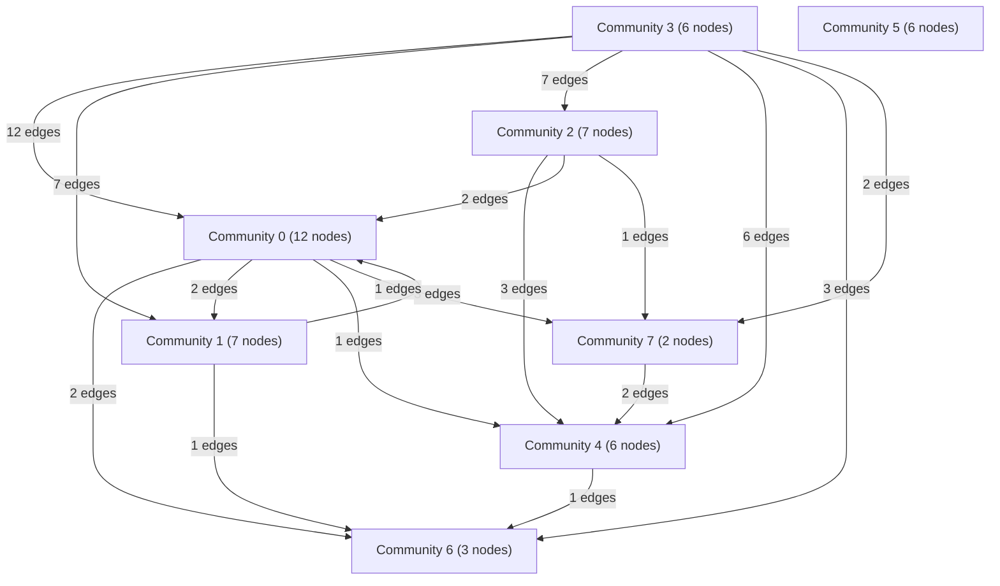

# Knowledge Graph Index

> Auto-generated by graphify. Start here — read community articles for context, then drill into god nodes for detail.

**49 nodes · 108 edges · 8 communities**

---

## System Architecture Flowchart

## Communities
(sorted by size, largest first)

- [[Community 0]] — 12 nodes
- [[Community 1]] — 7 nodes
- [[Community 2]] — 7 nodes
- [[Community 3]] — 6 nodes
- [[Community 4]] — 6 nodes
- [[Community 5]] — 6 nodes
- [[Community 6]] — 3 nodes
- [[Community 7]] — 2 nodes

## God Nodes
(most connected concepts — the load-bearing abstractions)

- [[validerTournee()]] — 12 connections
- [[lireOngletBrut()]] — 11 connections
- [[ouvrirClasseur()]] — 9 connections
- [[verifierR9Journee()]] — 9 connections
- [[heureVersMinutes()]] — 7 connections
- [[calculerPlanningTournee()]] — 6 connections
- [[minutesVersHeure()]] — 5 connections
- [[calculerPlanningAvecPauses()]] — 5 connections
- [[validerLivraisonFraisNuit()]] — 5 connections
- [[validerRegleR9()]] — 5 connections

---

*Generated by [graphify](https://github.com/safishamsi/graphify)*