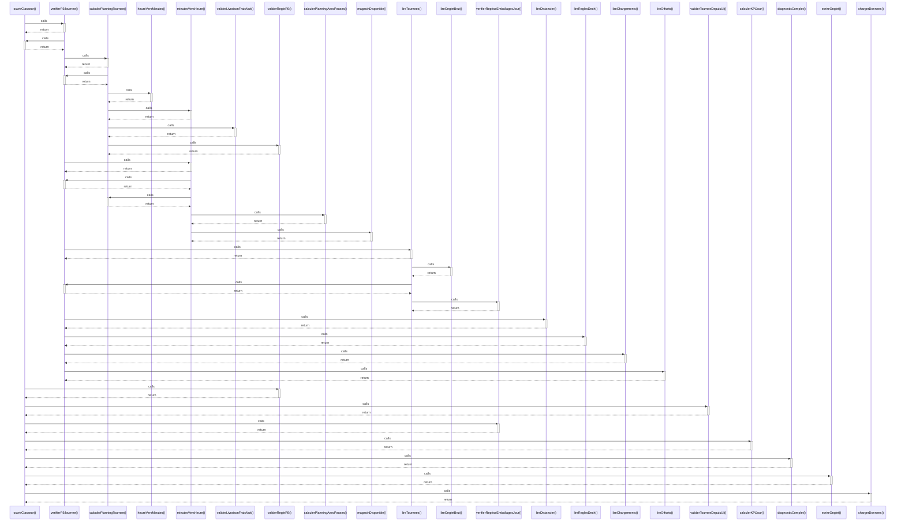

# ouvrirClasseur()

> God node · 9 connections · [C:\Users\STE0059945\Documents\Coding\Output\code\code.js](file:///C:/Users/STE0059945/Documents/Coding/Output/code/code.js#L35)

## Call Trace Diagram

## Connections by Relation

### calls
- [[verifierR9Journee()]] `EXTRACTED`
- [[validerRegleR9()]] `EXTRACTED`
- [[validerTourneeDepuisUI()]] `EXTRACTED`
- [[verifierRepriseEmballagesJour()]] `EXTRACTED`
- [[calculerKPIJour()]] `EXTRACTED`
- [[diagnosticComplet()]] `EXTRACTED`
- [[ecrireOnglet()]] `EXTRACTED`
- [[chargerDonnees()]] `EXTRACTED`

### contains
- [[code.js]] `EXTRACTED`

---

*Part of the graphify knowledge wiki. See [[index]] to navigate.*