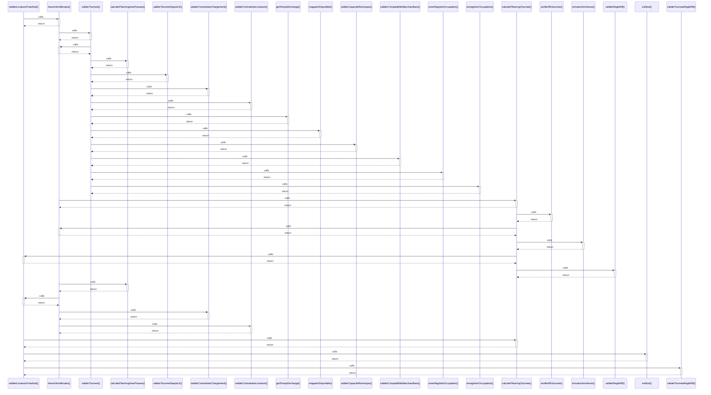

# validerLivraisonFraisNuit()

> God node · 5 connections · [C:\Users\STE0059945\Documents\Coding\Output\code\code.js](file:///C:/Users/STE0059945/Documents/Coding/Output/code/code.js#L372)

## Call Trace Diagram

## Connections by Relation

### calls
- [[heureVersMinutes()]] `EXTRACTED`
- [[calculerPlanningTournee()]] `EXTRACTED`
- [[estNuit()]] `EXTRACTED`
- [[validerTourneeRegleR9()]] `EXTRACTED`

### contains
- [[code.js]] `EXTRACTED`

---

*Part of the graphify knowledge wiki. See [[index]] to navigate.*