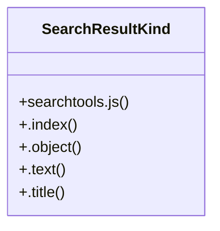

# Community 0

> 19 nodes · cohesion 0.12

## Key Concepts

- [searchtools.js](file:///C:/Users/STE0059945/Documents/Coding/Output/ctags-p6.2.20260705.0-x64/docs/_static/searchtools.js#L1) (9 connections)
- [SearchResultKind](file:///C:/Users/STE0059945/Documents/Coding/Output/ctags-p6.2.20260705.0-x64/docs/_static/searchtools.js#L45) (5 connections)
- [doctools.js](file:///C:/Users/STE0059945/Documents/Coding/Output/ctags-p6.2.20260705.0-x64/docs/_static/doctools.js#L1) (4 connections)
- [_displayItem()](file:///C:/Users/STE0059945/Documents/Coding/Output/ctags-p6.2.20260705.0-x64/docs/_static/searchtools.js#L71) (3 connections)
- [_displayNextItem()](file:///C:/Users/STE0059945/Documents/Coding/Output/ctags-p6.2.20260705.0-x64/docs/_static/searchtools.js#L144) (3 connections)
- [_finishSearch()](file:///C:/Users/STE0059945/Documents/Coding/Output/ctags-p6.2.20260705.0-x64/docs/_static/searchtools.js#L130) (3 connections)
- [_](file:///C:/Users/STE0059945/Documents/Coding/Output/ctags-p6.2.20260705.0-x64/docs/_static/doctools.js#L148) (2 connections)
- [_escapeHTML()](file:///C:/Users/STE0059945/Documents/Coding/Output/ctags-p6.2.20260705.0-x64/docs/_static/searchtools.js#L62) (2 connections)
- [BLACKLISTED_KEY_CONTROL_ELEMENTS](file:///C:/Users/STE0059945/Documents/Coding/Output/ctags-p6.2.20260705.0-x64/docs/_static/doctools.js#L6) (1 connections)
- [Documentation](file:///C:/Users/STE0059945/Documents/Coding/Output/ctags-p6.2.20260705.0-x64/docs/_static/doctools.js#L24) (1 connections)
- [_ready()](file:///C:/Users/STE0059945/Documents/Coding/Output/ctags-p6.2.20260705.0-x64/docs/_static/doctools.js#L13) (1 connections)
- [_escapeRegExp()](file:///C:/Users/STE0059945/Documents/Coding/Output/ctags-p6.2.20260705.0-x64/docs/_static/searchtools.js#L59) (1 connections)
- [_orderResultsByScoreThenName()](file:///C:/Users/STE0059945/Documents/Coding/Output/ctags-p6.2.20260705.0-x64/docs/_static/searchtools.js#L166) (1 connections)
- [_removeChildren()](file:///C:/Users/STE0059945/Documents/Coding/Output/ctags-p6.2.20260705.0-x64/docs/_static/searchtools.js#L52) (1 connections)
- [Search](file:///C:/Users/STE0059945/Documents/Coding/Output/ctags-p6.2.20260705.0-x64/docs/_static/searchtools.js#L197) (1 connections)
- [.index()](file:///C:/Users/STE0059945/Documents/Coding/Output/ctags-p6.2.20260705.0-x64/docs/_static/searchtools.js#L46) (1 connections)
- [.object()](file:///C:/Users/STE0059945/Documents/Coding/Output/ctags-p6.2.20260705.0-x64/docs/_static/searchtools.js#L47) (1 connections)
- [.text()](file:///C:/Users/STE0059945/Documents/Coding/Output/ctags-p6.2.20260705.0-x64/docs/_static/searchtools.js#L48) (1 connections)
- [.title()](file:///C:/Users/STE0059945/Documents/Coding/Output/ctags-p6.2.20260705.0-x64/docs/_static/searchtools.js#L49) (1 connections)

## Class Diagram

## Relationships

- No strong cross-community connections detected

## Source Files

- [C:\Users\STE0059945\Documents\Coding\Output\ctags-p6.2.20260705.0-x64\docs\_static\doctools.js](file:///C:/Users/STE0059945/Documents/Coding/Output/ctags-p6.2.20260705.0-x64/docs/_static/doctools.js)
- [C:\Users\STE0059945\Documents\Coding\Output\ctags-p6.2.20260705.0-x64\docs\_static\searchtools.js](file:///C:/Users/STE0059945/Documents/Coding/Output/ctags-p6.2.20260705.0-x64/docs/_static/searchtools.js)

## Audit Trail

- EXTRACTED: 40 (95%)
- INFERRED: 2 (5%)
- AMBIGUOUS: 0 (0%)

---

*Part of the graphify knowledge wiki. See [[index]] to navigate.*